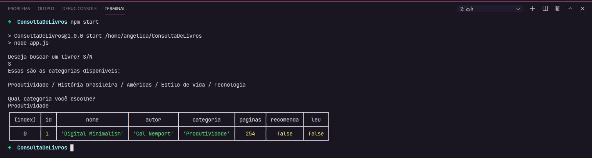

<h1 align="center">
   Consulta de Livros
</h1>

<p align="center">
  <a href="#-tecnologias">Tecnologias</a>&nbsp;&nbsp;&nbsp;|&nbsp;&nbsp;&nbsp;
  <a href="#-projeto">Projeto</a>&nbsp;&nbsp;&nbsp;|&nbsp;&nbsp;&nbsp;
  <a href="#-projeto">Como executar</a>
</p>

<p align="center">
  
</p>

## 🔧 Tecnologias 

Esse projeto foi desenvolvido com as seguintes tecnologias:

- JavaScript

## 🚀 Como executar

Clone o projeto e acesse a pasta do mesmo.

```bash
$ git clone https://github.com/angelbotazoli/ConsultaDeLivros.git
$ cd ConsultaDeLivros
```

Para iniciá-lo, siga os passos abaixo:
```bash
# Baixar as dependências
$ npm i

# Iniciar o projeto
$ npm start
```

## 💻 Projeto

O Consulta Livros é uma aplicação simples porém funcional, sendo possível listar livros cadastrados em um arquivo como base de dados. A interação com usuário é através do terminal por meio da lib readline-sync.

<br>

---
Desenvolvido durante [hiringcoders2](https://www.hiringcoders.com.br/)

